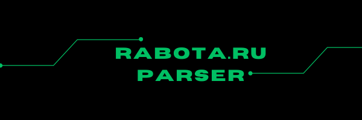

# Parser of current vacancies from Rabota.ru

<p align="center">
  
</p>


## Installation of Dependencies
===================

```
 pip install -r requirements.txt
```

## Application Registration and Token Retrieval

Steps:

    Register and log in to the website https://rabota.ru.
    Write your username in the USER field and your password in the PASSWORD field in the config.ini file, as specified during registration.
    Register your application at https://dev.rabota.ru/applications.
        Fill in the name, description, and select an icon (all arbitrary).
    Run the get_token.py file using the command:

```
python get_token.py
```

## Run

In the config.ini file, specify a numerical value for last_vacancy_id to start parsing from.
For example, if you specify the value 47986122, this vacancy and all newer vacancies will be parsed.
Run the command:

```
python rabota.py
```

## Configuration 

USER=example_name            <= Username on rabota.ru<br>
PASSWORD=example_password    <= Password of the user on rabota.ru<br>
TOKEN=example_token          <= Token obtained from rabota.ru<br>
ARCHIVE=archive.txt          <= Name and path to the file<br>
RESULT=result.txt            <= Name and path to the file<br>
start_id=47984122     		 <= Vacancy ID to start parsing from<br>
SLEEP=300                    <= Waiting time for new vacancies in seconds<br>
